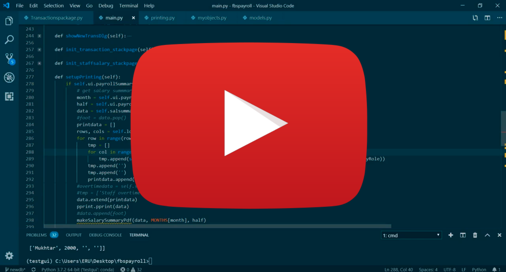
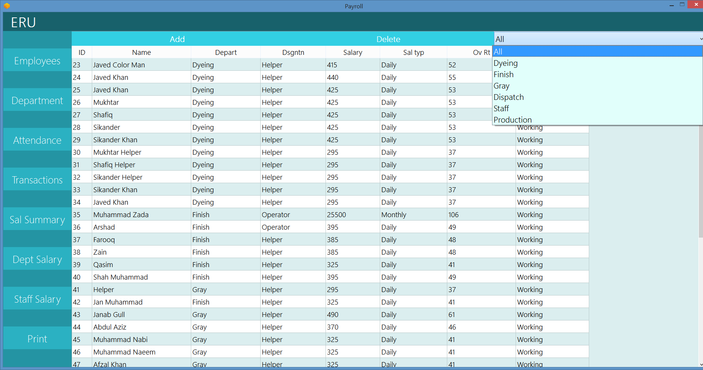
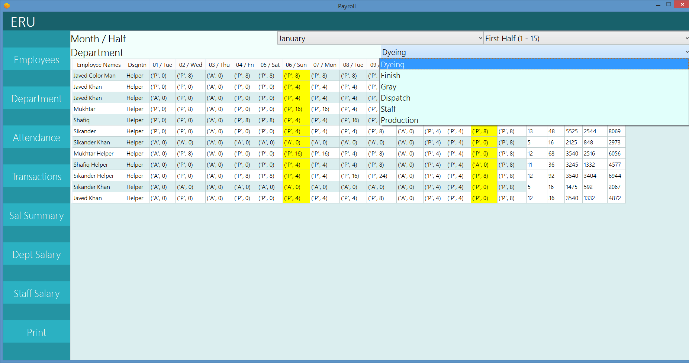
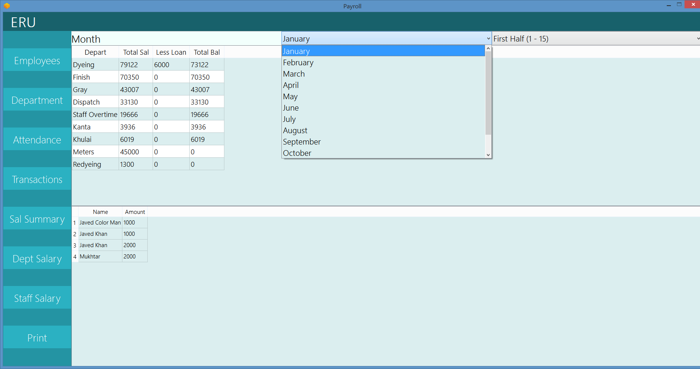
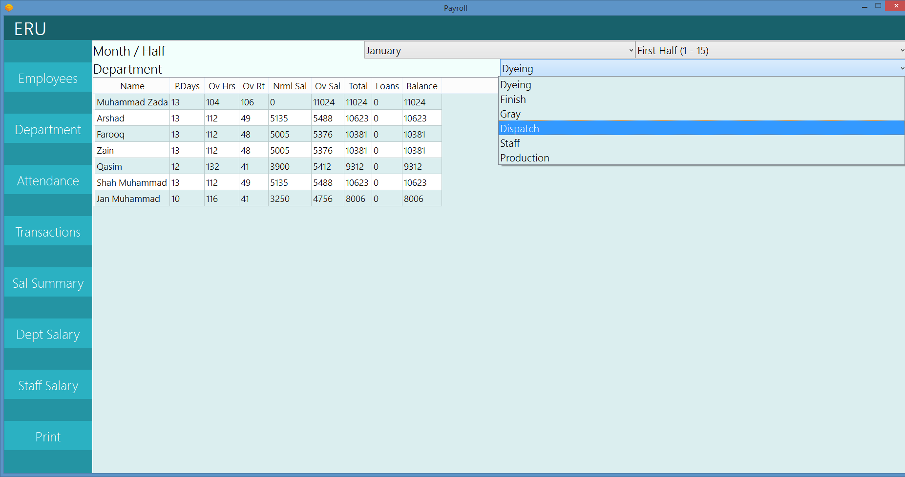
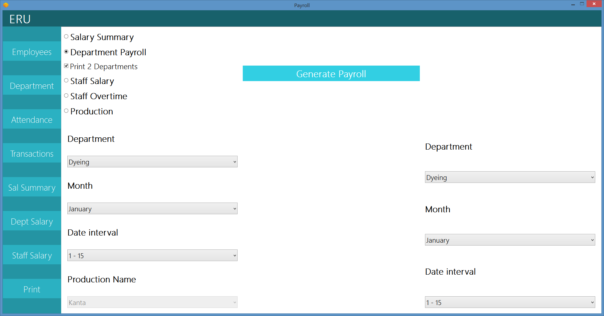

## PyPayroll

> A Payroll Management Desktop Application in Python.

## What it is

This was a project made for a user who wanted to able to track their employees' **Attendance, Overtime Hours, Loans and Advances**. Production's status and Transactions. Also wanted to be able to generate a Payroll for hourly rate staff, Monthly rate staff, Production dues and overtime. Also wanted to have the ability to update a transactions Ledger that kept track of loans and the balance of employees which can be deducted from the payroll. 

## Design Decisions

- **SQLite** Database.
- **Pyside2 / Qt for Python** GUI Framework.
- Multi-Platform (Tested in **Ubuntu** and **Windows**)
- Single Executable Installer .exe Packaged with **fbs.**
- Printable Payroll and PDF Generation with **ReportLab**
- Used Model View Controller design pattern.

## Coding Documentary Playlist:

## Screenshots:

### Main Employees Page:

### Attendance Page:

### Department Wise Salary Summary Page:

### Staff Salary Summary Page:

### Printing Page:

